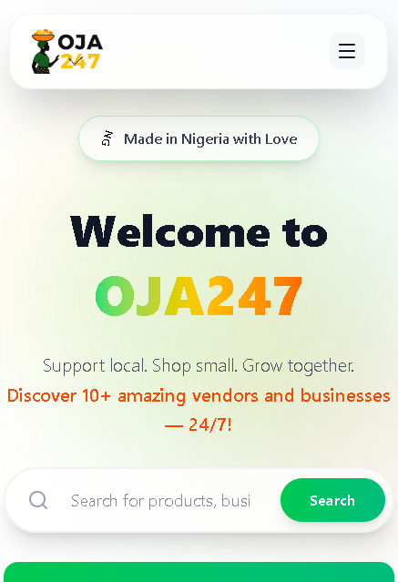

# 🚀 OJA247 — Nigerian Multi-Vendor Marketplace

[](LICENSE)
[](https://github.com/LaBoss999/OJA247/stargazers)

**OJA247** is a full-featured MERN-stack marketplace platform that empowers Nigerian small businesses to create their own online stores, manage products, and connect with customers 24/7.

> **"Support Local. Shop Small. Grow Together."**

---

## 📷 Screenshots

<table>
  <tr>
    <td></td>
    <td></td>
  </tr>
</table>

---

## ✨ Features

### 🛍️ For Customers
- **Browse businesses** across multiple categories (Food, Fashion, Tech, etc.)
- **Search & filter** by name, category, or location
- **View product catalogs** with prices and descriptions
- **Contact sellers** directly via WhatsApp
- **Responsive design** - works on all devices

### 🏪 For Business Owners
- **Secure registration** with email & password
- **Private dashboard** to manage business
- **Product management** - Add, edit, delete products with images
- **Image uploads** via Cloudinary
- **Business mini-website** - Unique page for each business
- **Real-time updates** - Changes reflect immediately

### 🔐 Security & Authentication
- **JWT-based authentication**
- **Password hashing** with bcrypt
- **Protected routes** - Only owners can edit their business
- **Session management** - Stay logged in across visits

---

## 🛠️ Tech Stack

### Frontend
- **React 18** - UI framework
- **React Router** - Navigation
- **Axios** - API requests
- **Tailwind CSS** - Styling
- **Framer Motion** - Animations

### Backend
- **Node.js** - Runtime
- **Express.js** - Web framework
- **MongoDB** - Database
- **Mongoose** - ODM
- **JWT** - Authentication
- **bcryptjs** - Password hashing
- **Cloudinary** - Image storage

---

## 📁 Project Structure

```
OJA247/
├── backend/
│   ├── src/
│   │   ├── models/
│   │   │   ├── Business.js
│   │   │   ├── Product.js
│   │   │   └── User.js
│   │   ├── controllers/
│   │   │   ├── businessController.js
│   │   │   ├── productController.js
│   │   │   └── authController.js
│   │   ├── routes/
│   │   │   ├── businessRoutes.js
│   │   │   ├── productRoutes.js
│   │   │   ├── authRoutes.js
│   │   │   └── uploadRoutes.js
│   │   ├── middleware/
│   │   │   └── authMiddleware.js
│   │   ├── config/
│   │   │   └── cloudinaryConfig.js
│   │   └── db.js
│   ├── server.js
│   ├── .env
│   └── package.json
│
└── oja247/ (frontend)
    ├── src/
    │   ├── components/
    │   │   ├── AddProductForm.jsx
    │   │   ├── ProductList.jsx
    │   │   ├── ImageUpload.jsx
    │   │   └── ProtectedRoute.jsx
    │   ├── pages/
    │   │   ├── LandingPage.jsx
    │   │   ├── ExplorePage.jsx
    │   │   ├── BusinessForm.jsx
    │   │   ├── BusinessDetails.jsx
    │   │   ├── BusinessDashboard.jsx
    │   │   └── LoginPage.jsx
    │   ├── context/
    │   │   └── AuthContext.jsx
    │   ├── App.jsx
    │   └── main.jsx
    ├── package.json
    └── README.md
```

---

## ⚙️ Installation & Setup

### Prerequisites
- Node.js v16+ installed
- MongoDB database (local or MongoDB Atlas)
- Cloudinary account (for image uploads)

### 1️⃣ Clone Repository
```bash
git clone https://github.com/LaBoss999/OJA247.git
cd OJA247
```

### 2️⃣ Backend Setup

```bash
cd backend
npm install
```

Create `.env` file in `backend/`:
```env
MONGO_URI=your_mongodb_connection_string
PORT=5000
JWT_SECRET=your_super_secret_jwt_key_here
CLOUDINARY_CLOUD_NAME=your_cloudinary_cloud_name
CLOUDINARY_API_KEY=your_cloudinary_api_key
CLOUDINARY_API_SECRET=your_cloudinary_api_secret
```

Start backend:
```bash
node server.js
```
✅ Backend running at `http://localhost:5000`

### 3️⃣ Frontend Setup

```bash
cd oja247
npm install
npm run dev
```
✅ Frontend running at `http://localhost:5173`

---

## 🔌 API Documentation

### Authentication Endpoints

#### Register Business
```http
POST /api/auth/register
Content-Type: application/json

{
  "email": "owner@business.com",
  "password": "password123",
  "businessData": {
    "name": "My Business",
    "category": "Food",
    "location": "Lagos",
    "contact": "+234 800 000 0000",
    "description": "Business description"
  }
}
```

#### Login
```http
POST /api/auth/login
Content-Type: application/json

{
  "email": "owner@business.com",
  "password": "password123"
}
```

#### Get Current User (Protected)
```http
GET /api/auth/me
Authorization: Bearer <token>
```

### Business Endpoints

```http
GET    /api/businesses        # Get all businesses
GET    /api/businesses/:id    # Get single business
POST   /api/businesses        # Create business (admin only)
```

### Product Endpoints

```http
GET    /api/products/business/:businessId  # Get products for a business
GET    /api/products/:id                   # Get single product
POST   /api/products                       # Create product (protected)
PUT    /api/products/:id                   # Update product (protected)
DELETE /api/products/:id                   # Delete product (protected)
GET    /api/products/search                # Search products
GET    /api/products/featured              # Get featured products
```

### Image Upload Endpoints

```http
POST   /api/upload/single     # Upload single image
POST   /api/upload/multiple   # Upload multiple images (max 5)
```

---

## 🚀 Usage Guide

### For Business Owners:

1. **Register Your Business**
   - Go to `/business-form`
   - Fill in business details + email + password
   - Submit form
   - Automatically logged in and redirected to dashboard

2. **Add Products**
   - From dashboard, click "Add Product" tab
   - Upload images (drag & drop or click)
   - Fill in product details (name, price, description)
   - Save product

3. **Manage Products**
   - View all your products in "My Products" tab
   - Edit product details inline
   - Delete products
   - Track stock levels

4. **Share Your Store**
   - Your unique store URL: `/business/:yourBusinessId`
   - Customers can browse products and contact you via WhatsApp

### For Customers:

1. **Browse Businesses**
   - Visit homepage
   - Search or filter by category
   - Click on any business card

2. **View Products**
   - Browse product catalog
   - See prices, descriptions, stock status
   - Click "Contact Seller" to message on WhatsApp

---

## 🧪 Testing

### Backend API Testing (Postman/Thunder Client)

**Test Registration:**
```
POST http://localhost:5000/api/auth/register
Body: { email, password, businessData }
Expected: 201 + { token, user, business }
```

**Test Login:**
```
POST http://localhost:5000/api/auth/login
Body: { email, password }
Expected: 200 + { token, user, business }
```

**Test Protected Route:**
```
GET http://localhost:5000/api/auth/me
Headers: { Authorization: Bearer <token> }
Expected: 200 + { user, business }
```

---

## 🌍 Deployment

### Backend (Render/Railway)
1. Push code to GitHub
2. Create new web service
3. Add environment variables
4. Deploy

### Frontend (Vercel - Recommended)
1. Import repository
2. Framework: Vite
3. Build command: `npm run build`
4. Output directory: `dist`
5. Deploy

### Database (MongoDB Atlas)
1. Create free cluster
2. Get connection string
3. Add to environment variables

---

## 🔒 Security Notes

- Passwords are hashed with bcrypt (never stored in plain text)
- JWT tokens expire after 30 days
- Protected routes require valid authentication
- Cloudinary credentials are server-side only
- CORS is configured for security

---

## 🗺️ Roadmap

- [ ] PWA (Progressive Web App) support
- [ ] Push notifications
- [ ] Payment integration (Paystack/Flutterwave)
- [ ] Customer reviews & ratings
- [ ] Analytics dashboard
- [ ] Email notifications
- [ ] Advanced search filters
- [ ] Business verification badges

---

## 🤝 Contributing

Contributions are welcome! Here's how:

1. Fork the repository
2. Create your feature branch (`git checkout -b feature/AmazingFeature`)
3. Commit your changes (`git commit -m 'Add some AmazingFeature'`)
4. Push to the branch (`git push origin feature/AmazingFeature`)
5. Open a Pull Request

---

## 📝 License

This project is licensed under the MIT License - see the [LICENSE](LICENSE) file for details.

---

## 👨‍💻 Authors

**OLanrewaju**
- GitHub: [@lan647](https://github.com/lanre647)

**Ebenezer**
- GitHub: [@LaBoss999](https://github.com/LaBoss999)

---

## 🙏 Acknowledgments

- Built with ❤️ for Nigerian small businesses
- Inspired by the need for accessible e-commerce solutions
- Thanks to the open-source community

---

## 📞 Support & Contact

- 🐛 **Found a bug?** [Open an issue](https://github.com/LaBoss999/OJA247/issues)
- 💡 **Feature request?** [Start a discussion](https://github.com/LaBoss999/OJA247/discussions)
- 📧 **Email:** info@oja247.com

---

<div align="center">

**⭐ Star this repo if you find it helpful!**

Made with 💚 in Nigeria 🇳🇬

</div>
